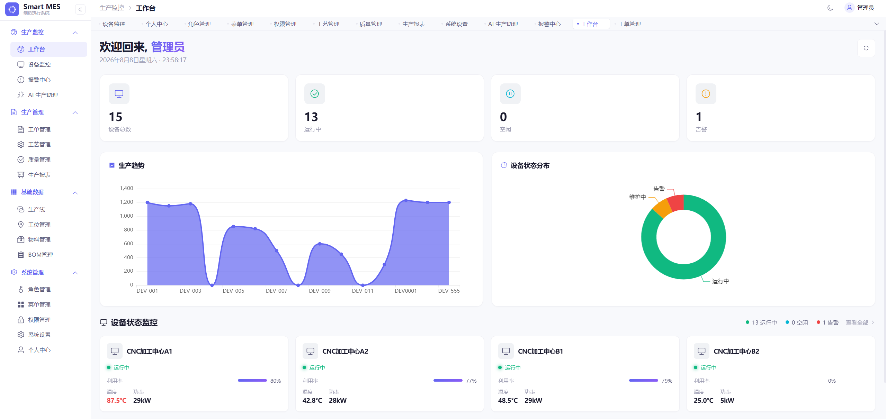
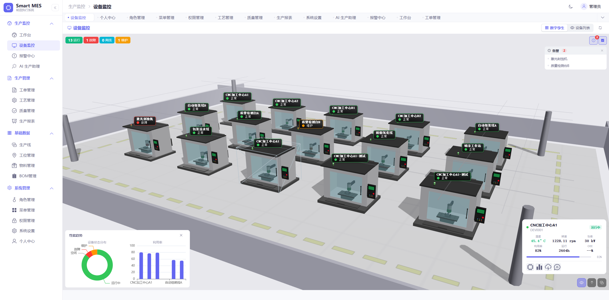
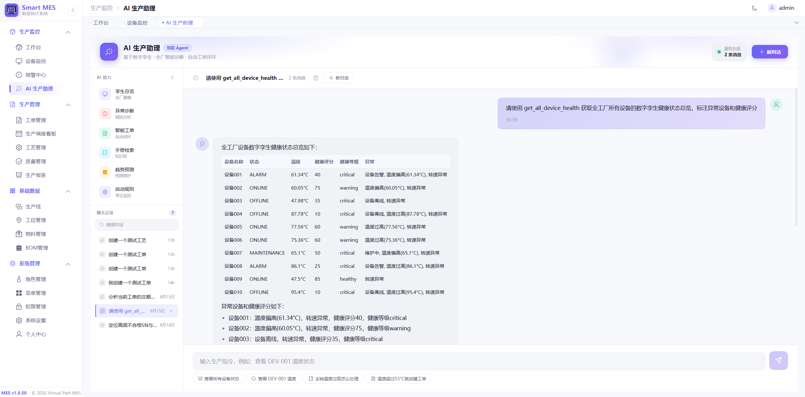
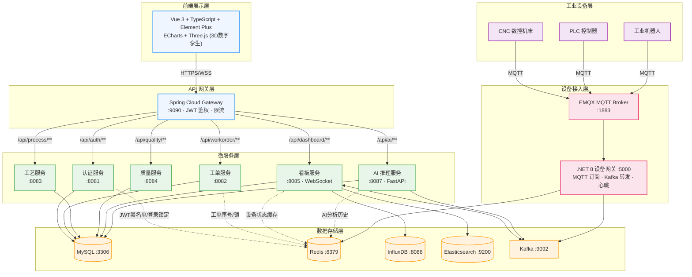

<div align="center">

# Smart Factory MES System

**开源智能工厂制造执行系统** — 面向离散制造业的工业互联网平台

基于微服务架构 · 3D 数字孪生 · AI 智能助理 · 支持 2000+ 设备并发连接


[](https://github.com/xianshi3/smart-factory-mes-system/actions)
[](https://github.com/xianshi3/smart-factory-mes-system/releases)
[](LICENSE)
[](https://github.com/xianshi3/smart-factory-mes-system/stargazers)
[](https://github.com/xianshi3/smart-factory-mes-system/forks)
[](https://github.com/xianshi3/smart-factory-mes-system/issues)
[](https://www.oracle.com/java/)
[](https://spring.io/projects/spring-cloud)
[](https://vuejs.org/)
[](https://www.python.org/)
[](https://dotnet.microsoft.com/)

**English** · [简体中文](#-项目简介) · [API Docs](docs/DEVELOPMENT.md) · [Report Bug](https://github.com/xianshi3/smart-factory-mes-system/issues) · [Request Feature](https://github.com/xianshi3/smart-factory-mes-system/issues)

---

</div>

## 目录

- [项目简介](#-项目简介)
- [核心特性](#-核心特性)
- [界面预览](#-界面预览)
- [技术架构](#-技术架构)
- [项目结构](#-项目结构)
- [快速开始](#-快速开始)
- [访问地址与默认账号](#-访问地址与默认账号)
- [文档](#-文档)
- [参与贡献](#-参与贡献)
- [许可证](#-许可证)

---

## 项目简介

智能工厂制造执行系统（**M**anufacturing **E**xecution **S**ystem）面向离散制造业，覆盖**生产工单 → 工艺执行 → 质量检验 → 设备监控 → AI 分析**全流程，通过 **MQTT + Kafka** 实现万级吞吐的设备数据采集，配合 **3D 数字孪生**与 **AI 生产助理**，打造开箱即用的智能工厂数字化底座。

| 2000+ | 10000+/s | 6 大微服务 | 95% | AI Agent |
|:---:|:---:|:---:|:---:|:---:|
| 设备并发连接 | 数据吞吐 | 独立部署 | 质量预测准确率 | 自然语言生产助理 |

---

## 核心特性

| 特性 | 说明 |
|------|------|
| **微服务架构** | Spring Cloud 2023 设计 6 大核心服务，服务解耦、独立部署、水平扩展 |
| **3D 数字孪生** | Three.js 构建工厂车间三维场景，实时映射设备状态、动效与数据 |
| **高并发设备接入** | MQTT 协议采集 + Kafka 消息队列，10000+ 条/秒数据吞吐 |
| **实时数据展示** | WebSocket 毫秒级推送，InfluxDB 时序数据库存储 |
| **AI 智能预测** | FastAPI 推理服务，LightGBM/XGBoost 模型，支持 ONNX 部署 |
| **AI Agent 生产助理** | GLM-4 function calling 多步推理，自然语言 → 工具调用 → 任务闭环 |
| **全链路权限控制** | JWT + Spring Security，RBAC 菜单级 / 按钮级权限 |
| **SPC 统计分析** | 真实规格限 + 8 条 Nelson 判异规则 + 全过程能力指数 + 控制图 |

---

## 界面预览

<div align="center">

**生产看板**



**设备监控（3D 数字孪生）**



**AI 生产助理**



</div>

---

## 技术架构

### 整体架构图



### 技术栈

| 层级 | 技术选型 | 版本 |
|------|----------|------|
| 前端 | Vue 3 + TypeScript + Element Plus + Pinia + Vite | 3.5 / 2.9 / 2.3 / 6.0 |
| 3D / 可视化 | Three.js + ECharts + GoJS | 0.172 / 5.6 |
| 后端 | Spring Boot + Spring Cloud (Alibaba) | 3.2.5 / 2023.0.0 |
| 持久层 | MyBatis-Plus + MySQL | 3.5.6 / 8.0.33 |
| 缓存 / 消息 | Redis + Kafka + Zookeeper | 7 / 3.4 |
| 时序 / 搜索 | InfluxDB + Elasticsearch | 2.7 / 8.10.0 |
| 设备接入 | .NET 8 + EMQX MQTT | .NET 8 |
| AI 推理 | Python FastAPI + LightGBM + XGBoost | 0.115 / 4.5 / 2.1 |
| AI Agent | GLM-4 + Function Calling + RAG + ChromaDB | - |

---

## 项目结构

```
Smart-Factory-MES-System/
├── docs/                            # 项目文档（开发指南 / 数据库 / 更新日志）
├── mes-common/                      # 公共模块（实体类、工具类、异常处理）
├── mes-gateway/                     # API 网关 (9090) — 统一路由 / 鉴权 / 限流
├── mes-auth/                        # 认证服务 (8081) — 登录 / JWT / RBAC 权限
├── mes-workorder/                   # 工单服务 (8082) — 工单全生命周期
├── mes-process/                     # 工艺服务 (8083) — 工艺模板 / 参数配置
├── mes-quality/                     # 质量服务 (8084) — 质检记录 / 质量追溯 / SPC
├── mes-dashboard/                   # 看板服务 (8085) — 实时数据 / WebSocket 推送
├── mes-device-gateway/              # .NET 设备网关 (5000) — MQTT 接入 / Kafka 转发
├── mes-ai-service/                  # Python AI 服务 (8087) — 预测 / Agent / RAG
├── mes-frontend/                    # Vue 3 前端 (3000) — 生产看板 / 3D 数字孪生
├── mes-device-simulator-wpf/        # WPF 设备模拟器 — 模拟 2000+ 设备数据上报
├── sql/                             # 数据库脚本（init + V2~V9 迁移）
├── Makefile                         # 统一启动 / 构建命令
└── docker-compose.yml               # 基础设施编排（MySQL / Redis / Kafka / Nacos）
```

---

## 快速开始

### 环境要求

| 工具 | 版本 | 用途 |
|------|------|------|
| Docker | 24+ | 基础设施（MySQL / Redis / Kafka / Nacos） |
| JDK | 17+ | Java 后端服务 |
| Maven | 3.9+ | 后端构建 |
| Node.js | 18+ | 前端开发 |
| Python | 3.11+ | AI 服务（可选） |
| .NET SDK | 8.0+ | 设备网关（可选） |

> **架构说明**：Docker 仅运行基础设施，Java 后端在宿主机直接运行，便于开发调试。

### 一键启动（推荐）

```bash
# ① 启动基础设施
make docker

# ② 启动 Java 后端（自动编译）
make backend

# ③ 启动 AI 服务与前端
make ai
make frontend
```

### 手动启动

```bash
# ① 编译后端
mvn clean package -DskipTests

# ② 启动基础设施
docker compose up -d

# ③ 启动 Java 服务
java -jar mes-auth/target/mes-auth-1.0.0-SNAPSHOT.jar
java -jar mes-workorder/target/mes-workorder-1.0.0-SNAPSHOT.jar
java -jar mes-process/target/mes-process-1.0.0-SNAPSHOT.jar
java -jar mes-quality/target/mes-quality-1.0.0-SNAPSHOT.jar
java -jar mes-dashboard/target/mes-dashboard-1.0.0-SNAPSHOT.jar
java -jar mes-gateway/target/mes-gateway-1.0.0-SNAPSHOT.jar

# ④ 启动前端
cd mes-frontend && npm install && npm run dev
```

### API 快速体验

```bash
# 登录获取 Token
curl -X POST http://localhost:8081/auth/login \
  -H "Content-Type: application/json" \
  -d '{"username": "admin", "password": "admin123"}'

# 工单分页查询
curl http://localhost:8082/workorder/page?current=1&size=10 \
  -H "Authorization: Bearer <token>"
```

---

## 访问地址与默认账号

| 服务 | 地址 | 说明 |
|------|------|------|
| 前端首页 | http://localhost:3000 | Vue 3 应用 |
| API 网关 | http://localhost:9090 | Spring Cloud Gateway |
| 认证服务 | http://localhost:8081/doc.html | Knife4j API 文档 |
| 工单服务 | http://localhost:8082/doc.html | - |
| 工艺服务 | http://localhost:8083/doc.html | - |
| 质量服务 | http://localhost:8084/doc.html | - |
| 看板服务 | http://localhost:8085/doc.html | - |
| AI 服务 | http://localhost:8087/docs | FastAPI 文档 |
| 设备网关 | http://localhost:5000 | ASP.NET Core |
| MySQL | localhost:3306 | root / root |
| Redis | localhost:6379 | 无密码 |
| Nacos | http://localhost:8848/nacos | nacos / nacos |

| 系统 | 账号 | 密码 |
|------|------|------|
| 前端登录 | `admin` | `admin123` |
| EMQX | `admin` | `public` |

---

## 文档

| 文档 | 说明 |
|------|------|
| [开发指南](docs/DEVELOPMENT.md) | 本地开发、环境搭建、调试技巧 |
| [数据库设计](docs/DATABASE.md) | 表结构、ER 关系、迁移脚本 |
| [更新日志](docs/CHANGELOG.md) | 版本历史与变更记录 |
| [项目介绍](docs/INTERVIEW.md) | 架构演进、AI Agent 方案、比赛复盘 |

---

## 参与贡献

欢迎提交 [Issue](https://github.com/xianshi3/smart-factory-mes-system/issues) 与 [Pull Request](https://github.com/xianshi3/smart-factory-mes-system/pulls)！

1. **Fork** 本仓库并从 `develop` 拉取分支
2. **编码** — 遵循 [贡献指南](CONTRIBUTING.md) 与代码规范
3. **验证** — 通过 CI 构建（后端 `mvn compile` / 前端 `npm run build`）
4. **提交** — 发起 PR 到 `develop`，等待 Review

更多细节请参阅 [CONTRIBUTING.md](CONTRIBUTING.md) · [行为准则](CODE_OF_CONDUCT.md)

---

## 许可证

本项目基于 [MIT License](LICENSE) 开源，欢迎学习、使用与二次开发。

---

<div align="center">

**如果这个项目对你有帮助，请给我们一个 Star！**

Powered by Spring Cloud · Vue 3 · .NET 8 · Python

</div>
