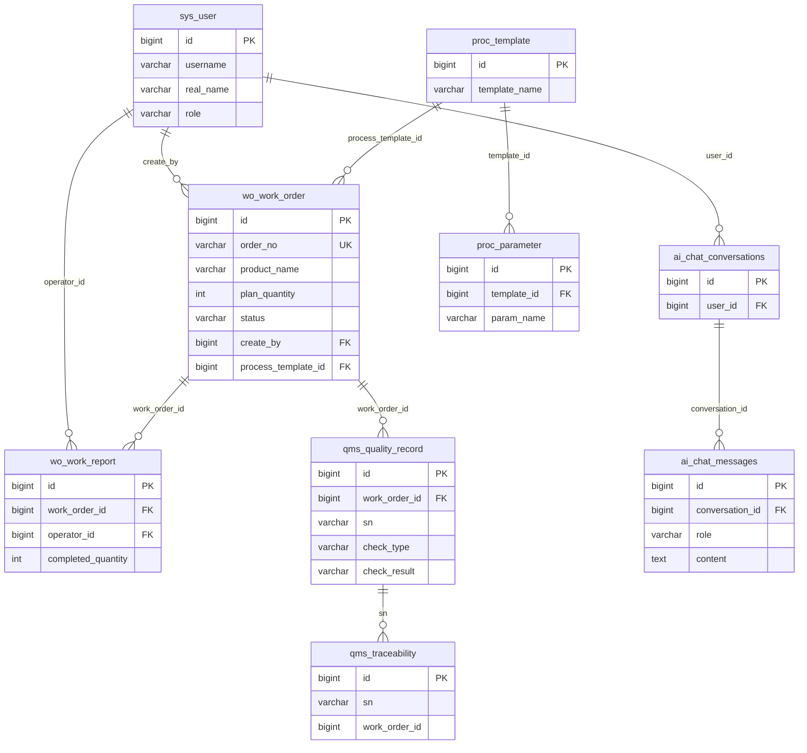

# Smart Factory MES System 数据库设计文档

## 数据库概览

- **数据库名**: mes_db
- **字符集**: utf8mb4
- **存储引擎**: InnoDB

---

## 表结构总览

### 1. 用户表 sys_user

| 字段 | 类型 | 说明 | 约束 |
|-----|------|------|------|
| id | bigint | 主键ID | PK, AUTO_INCREMENT |
| username | varchar(50) | 用户名 | NOT NULL, UNIQUE |
| password | varchar(255) | 密码 | NOT NULL |
| real_name | varchar(50) | 真实姓名 | |
| nickname | varchar(50) | 昵称 | |
| phone | varchar(20) | 手机号 | |
| email | varchar(100) | 邮箱 | |
| avatar | varchar(255) | 头像URL | |
| employee_no | varchar(50) | 员工编号 | UNIQUE |
| department | varchar(50) | 部门 | |
| position | varchar(50) | 岗位 | |
| manager_id | bigint | 直接上级ID | |
| hire_date | date | 入职日期 | |
| status | int | 状态: 1在职 0离职 | DEFAULT 1 |
| role | varchar(20) | 角色字符串 | DEFAULT 'USER' |
| role_id | bigint | 角色ID(关联sys_role) | INDEX |
| create_time | datetime | 创建时间 | DEFAULT CURRENT_TIMESTAMP |
| update_time | datetime | 更新时间 | ON UPDATE CURRENT_TIMESTAMP |
| deleted | int | 逻辑删除 | DEFAULT 0 |
| deleted_time | datetime | 删除时间 | |
| deleted_by | bigint | 删除人ID | |
| version | int | 乐观锁 | DEFAULT 0 |

**索引**: `uk_username` (username, deleted), `uk_employee_no` (employee_no), `idx_role_id` (role_id)

> **密码存储规范**: `password` 字段统一存储 BCrypt hash（`$2a$10$` 前缀，Spring Security `BCryptPasswordEncoder` 格式），禁止明文落库。种子数据（admin 等 5 用户，密码均为 `admin123`）的 hash 为真实可校验值。`AuthService` 保留明文比较兜底分支仅用于兼容历史明文存量库，新写入（注册/改密）一律 BCrypt 加密。

---

### 2. 角色表 sys_role

| 字段 | 类型 | 说明 | 约束 |
|-----|------|------|------|
| id | bigint | 主键ID | PK, AUTO_INCREMENT |
| role_name | varchar(50) | 角色名称 | NOT NULL |
| role_code | varchar(50) | 角色编码 | NOT NULL, UNIQUE |
| description | varchar(255) | 角色描述 | |
| sort | int | 排序 | DEFAULT 0 |
| status | int | 状态: 1启用 0禁用 | DEFAULT 1 |
| create_time | datetime | 创建时间 | DEFAULT CURRENT_TIMESTAMP |
| update_time | datetime | 更新时间 | ON UPDATE CURRENT_TIMESTAMP |
| deleted | int | 逻辑删除 | DEFAULT 0 |
| deleted_time | datetime | 删除时间 | |
| deleted_by | bigint | 删除人ID | |
| version | int | 乐观锁 | DEFAULT 0 |

---

### 3. 权限表 sys_permission

| 字段 | 类型 | 说明 | 约束 |
|-----|------|------|------|
| id | bigint | 主键ID | PK, AUTO_INCREMENT |
| permission_name | varchar(100) | 权限名称 | NOT NULL |
| permission_code | varchar(100) | 权限编码 | NOT NULL, UNIQUE |
| permission_type | varchar(20) | 类型: MENU/BUTTON/API | NOT NULL |
| parent_id | bigint | 父权限ID | DEFAULT 0 |
| path | varchar(255) | 路由路径 | |
| icon | varchar(50) | 图标 | |
| sort | int | 排序 | DEFAULT 0 |
| status | int | 状态: 1启用 0禁用 | DEFAULT 1 |
| create_time | datetime | 创建时间 | DEFAULT CURRENT_TIMESTAMP |
| update_time | datetime | 更新时间 | ON UPDATE CURRENT_TIMESTAMP |
| deleted | int | 逻辑删除 | DEFAULT 0 |
| deleted_time | datetime | 删除时间 | |
| deleted_by | bigint | 删除人ID | |
| version | int | 乐观锁 | DEFAULT 0 |

---

### 4. 菜单表 sys_menu

| 字段 | 类型 | 说明 | 约束 |
|-----|------|------|------|
| id | bigint | 主键ID | PK, AUTO_INCREMENT |
| menu_name | varchar(50) | 菜单名称 | NOT NULL |
| menu_code | varchar(50) | 菜单编码 | NOT NULL, UNIQUE |
| parent_id | bigint | 父菜单ID | DEFAULT 0 |
| path | varchar(255) | 路由路径 | |
| component | varchar(255) | 组件路径 | |
| icon | varchar(50) | 图标 | |
| sort | int | 排序 | DEFAULT 0 |
| visible | int | 是否可见: 1是 0否 | DEFAULT 1 |
| status | int | 状态: 1启用 0禁用 | DEFAULT 1 |
| create_time | datetime | 创建时间 | DEFAULT CURRENT_TIMESTAMP |
| update_time | datetime | 更新时间 | ON UPDATE CURRENT_TIMESTAMP |
| deleted | int | 逻辑删除 | DEFAULT 0 |
| deleted_time | datetime | 删除时间 | |
| deleted_by | bigint | 删除人ID | |
| version | int | 乐观锁 | DEFAULT 0 |

---

### 5. 角色-权限关联表 sys_role_permission

| 字段 | 类型 | 说明 | 约束 |
|-----|------|------|------|
| id | bigint | 主键ID | PK, AUTO_INCREMENT |
| role_id | bigint | 角色ID | NOT NULL, INDEX |
| permission_id | bigint | 权限ID | NOT NULL, INDEX |
| sort | int | 排序 | DEFAULT 0 |
| create_time | datetime | 创建时间 | DEFAULT CURRENT_TIMESTAMP |
| deleted_time | datetime | 删除时间 | |
| deleted_by | bigint | 删除人ID | |
| version | int | 乐观锁 | DEFAULT 0 |

---

### 6. 工单表 wo_work_order

| 字段 | 类型 | 说明 | 约束 |
|-----|------|------|------|
| id | bigint | 主键ID | PK, AUTO_INCREMENT |
| order_no | varchar(50) | 工单编号 | NOT NULL, UNIQUE |
| product_name | varchar(100) | 产品名称 | NOT NULL |
| product_model | varchar(100) | 产品型号 | |
| plan_quantity | int | 计划数量 | NOT NULL |
| completed_quantity | int | 已完成数量 | DEFAULT 0 |
| status | varchar(20) | 状态 | NOT NULL |
| workstation_id | bigint | 工位ID | |
| process_template_id | bigint | 工艺模板ID | |
| priority | varchar(20) | 优先级 | DEFAULT 'MEDIUM' |
| planned_start_time | datetime | 计划开始时间 | |
| planned_end_time | datetime | 计划结束时间 | |
| actual_start_time | datetime | 实际开始时间 | |
| actual_end_time | datetime | 实际结束时间 | |
| remark | varchar(500) | 备注 | |
| create_by | bigint | 创建人ID | |
| issue_by | bigint | 下发人ID | |
| create_time | datetime | 创建时间 | DEFAULT CURRENT_TIMESTAMP |
| update_time | datetime | 更新时间 | ON UPDATE CURRENT_TIMESTAMP |
| deleted | int | 逻辑删除 | DEFAULT 0 |
| deleted_time | datetime | 删除时间 | |
| deleted_by | bigint | 删除人ID | |
| version | int | 乐观锁 | DEFAULT 0 |

**状态枚举**: CREATED / ISSUED / IN_PRODUCTION / PENDING_QC / COMPLETED / CLOSED

---

### 7. 报工记录表 wo_work_report

| 字段 | 类型 | 说明 | 约束 |
|-----|------|------|------|
| id | bigint | 主键ID | PK, AUTO_INCREMENT |
| work_order_id | bigint | 工单ID | NOT NULL |
| device_id | bigint | 设备ID | |
| operator_id | bigint | 操作员ID | |
| report_quantity | int | 报工数量 | NOT NULL |
| qualified_quantity | int | 合格数量 | |
| defective_quantity | int | 不合格数量 | DEFAULT 0 |
| report_time | datetime | 报工时间 | NOT NULL |
| sn_start | varchar(100) | 序列号起始 | |
| sn_end | varchar(100) | 序列号结束 | |
| remark | varchar(500) | 备注 | |
| create_time | datetime | 创建时间 | DEFAULT CURRENT_TIMESTAMP |
| update_time | datetime | 更新时间 | ON UPDATE CURRENT_TIMESTAMP |
| deleted | int | 逻辑删除 | DEFAULT 0 |
| deleted_time | datetime | 删除时间 | |
| deleted_by | bigint | 删除人ID | |
| version | int | 乐观锁 | DEFAULT 0 |

**索引**:
- `idx_work_order_id` (work_order_id)
- `idx_report_time` (report_time)

---

### 8. 工艺模板表 proc_template

| 字段 | 类型 | 说明 | 约束 |
|-----|------|------|------|
| id | bigint | 主键ID | PK, AUTO_INCREMENT |
| template_name | varchar(100) | 模板名称 | NOT NULL |
| template_code | varchar(50) | 模板编码 | NOT NULL, UNIQUE |
| product_model | varchar(100) | 适用产品型号 | |
| status | varchar(20) | 状态 | DEFAULT 'DRAFT' |
| version | int | 版本号 | DEFAULT 1 |
| remark | varchar(500) | 备注 | |
| create_by | bigint | 创建人ID | |
| publish_by | bigint | 发布人ID | |
| create_time | datetime | 创建时间 | DEFAULT CURRENT_TIMESTAMP |
| update_time | datetime | 更新时间 | ON UPDATE CURRENT_TIMESTAMP |
| deleted | int | 逻辑删除 | DEFAULT 0 |
| deleted_time | datetime | 删除时间 | |
| deleted_by | bigint | 删除人ID | |
| version | int | 乐观锁 | DEFAULT 0 |

**状态枚举**: DRAFT / PUBLISHED

---

### 9. 工艺参数表 proc_parameter

| 字段 | 类型 | 说明 | 约束 |
|-----|------|------|------|
| id | bigint | 主键ID | PK, AUTO_INCREMENT |
| template_id | bigint | 模板ID | NOT NULL |
| param_name | varchar(50) | 参数名称 | NOT NULL |
| param_code | varchar(50) | 参数编码 | NOT NULL |
| param_type | varchar(20) | 参数类型 | NOT NULL |
| param_value | varchar(100) | 参数值 | NOT NULL |
| unit | varchar(20) | 单位 | |
| min_value | double | 最小值 | |
| max_value | double | 最大值 | |
| create_time | datetime | 创建时间 | DEFAULT CURRENT_TIMESTAMP |
| update_time | datetime | 更新时间 | ON UPDATE CURRENT_TIMESTAMP |
| deleted | int | 逻辑删除 | DEFAULT 0 |
| deleted_time | datetime | 删除时间 | |
| deleted_by | bigint | 删除人ID | |
| version | int | 乐观锁 | DEFAULT 0 |

**索引**:
- `idx_template_id` (template_id)

---

### 10. 质检记录表 qms_quality_record

| 字段 | 类型 | 说明 | 约束 |
|-----|------|------|------|
| id | bigint | 主键ID | PK, AUTO_INCREMENT |
| work_order_id | bigint | 工单ID | |
| work_order_no | varchar(50) | 工单号 | |
| sn | varchar(100) | 产品序列号SN | |
| device_id | bigint | 设备ID | |
| workstation_id | bigint | 工位ID | |
| operator_id | bigint | 操作员ID | |
| check_type | varchar(20) | 检验类型 | |
| check_result | varchar(20) | 检验结果 | |
| defect_type | varchar(50) | 缺陷类型 | |
| defect_desc | varchar(500) | 缺陷描述 | |
| check_time | datetime | 检验时间 | |
| remark | varchar(500) | 备注 | |
| create_time | datetime | 创建时间 | DEFAULT CURRENT_TIMESTAMP |
| update_time | datetime | 更新时间 | ON UPDATE CURRENT_TIMESTAMP |
| deleted | int | 逻辑删除 | DEFAULT 0 |
| deleted_time | datetime | 删除时间 | |
| deleted_by | bigint | 删除人ID | |
| version | int | 乐观锁 | DEFAULT 0 |

**检验类型**: IPQC / FQC / OQC
**检验结果**: PASSED / FAILED / REWORK

**索引**:
- `idx_work_order_id` (work_order_id)
- `idx_sn` (sn)
- `idx_check_type` (check_type)
- `idx_check_result` (check_result)
- `idx_check_time` (check_time)

---

### 11. 追溯记录表 qms_traceability

| 字段 | 类型 | 说明 | 约束 |
|-----|------|------|------|
| id | bigint | 主键ID | PK, AUTO_INCREMENT |
| sn | varchar(100) | 产品序列号SN | NOT NULL |
| work_order_id | bigint | 工单ID | |
| work_order_no | varchar(50) | 工单号 | |
| product_name | varchar(100) | 产品名称 | |
| product_model | varchar(100) | 产品型号 | |
| process_name | varchar(100) | 工序名称 | |
| process_no | varchar(50) | 工序编号 | |
| device_id | bigint | 设备ID | |
| device_name | varchar(100) | 设备名称 | |
| operator_id | bigint | 操作员ID | |
| operator_name | varchar(50) | 操作员姓名 | |
| start_time | datetime | 开始时间 | |
| end_time | datetime | 结束时间 | |
| duration | int | 时长(秒) | |
| result | varchar(20) | 结果 | |
| parameters | text | 工艺参数(JSON) | |
| create_time | datetime | 创建时间 | DEFAULT CURRENT_TIMESTAMP |
| update_time | datetime | 更新时间 | ON UPDATE CURRENT_TIMESTAMP |
| deleted | int | 逻辑删除 | DEFAULT 0 |
| deleted_time | datetime | 删除时间 | |
| deleted_by | bigint | 删除人ID | |

**索引**:
- `idx_sn` (sn)
- `idx_work_order_id` (work_order_id)

---

### 12. AI 对话记录表 ai_chat_conversations

| 字段 | 类型 | 说明 | 约束 |
|-----|------|------|------|
| id | varchar(36) | 对话ID (UUID) | PK |
| user_id | varchar(50) | 用户ID | NOT NULL, INDEX |
| title | varchar(200) | 对话标题 | DEFAULT '新对话' |
| create_time | datetime | 创建时间 | DEFAULT CURRENT_TIMESTAMP |
| update_time | datetime | 更新时间 | ON UPDATE CURRENT_TIMESTAMP |
| deleted | int | 逻辑删除 | DEFAULT 0 |

**索引**: `idx_user_id` (user_id), `idx_update_time` (update_time)

### 13. AI 消息记录表 ai_chat_messages

| 字段 | 类型 | 说明 | 约束 |
|-----|------|------|------|
| id | bigint | 主键ID | PK, AUTO_INCREMENT |
| conversation_id | varchar(36) | 所属对话ID | NOT NULL, INDEX |
| role | varchar(20) | 角色: user / assistant | NOT NULL |
| content | text | 消息内容 (Markdown) | NOT NULL |
| steps | json | Agent 执行步骤 | |
| create_time | datetime | 创建时间 | DEFAULT CURRENT_TIMESTAMP |

**索引**: `idx_conversation_id` (conversation_id)

---

### 14. AI 分析历史表 ai_analysis_history

| 字段 | 类型 | 说明 | 约束 |
|-----|------|------|------|
| id | bigint | 主键ID | PK, AUTO_INCREMENT |
| user_id | varchar(50) | 用户ID | NOT NULL, DEFAULT 'default', INDEX |
| device_code | varchar(50) | 设备编码 | |
| device_name | varchar(100) | 设备名称 | |
| analysis_type | varchar(20) | 分析类型: spc / energy / capacity / llm | NOT NULL, INDEX |
| result_data | json | 分析结果数据 (完整JSON) | |
| create_time | datetime | 创建时间 | DEFAULT CURRENT_TIMESTAMP |

**索引**: `idx_user_id` (user_id), `idx_type` (analysis_type)

**说明**:
- 由 mes-ai-service 独有（与 ai_chat_* 表同属 AI 服务域）
- 按 `user_id` 隔离，按 `device_code` 过滤（每台设备只看自己的历史）
- `DELETE /api/v1/agent/analysis/{id}` 物理删除（校验 user_id）

---

## 表关系图



---

## 索引汇总

| 表名 | 索引名 | 字段 |
|-----|-------|------|
| sys_user | uk_username | username, deleted |
| sys_user | uk_employee_no | employee_no |
| sys_user | idx_role_id | role_id |
| sys_role | uk_role_code | role_code |
| sys_permission | uk_permission_code | permission_code |
| sys_menu | uk_menu_code | menu_code |
| sys_role_permission | idx_role_id | role_id |
| sys_role_permission | idx_permission_id | permission_id |
| wo_work_order | uk_order_no | order_no |
| wo_work_order | idx_status | status |
| wo_work_order | idx_create_time | create_time |
| wo_work_report | idx_work_order_id | work_order_id |
| wo_work_report | idx_report_time | report_time |
| proc_template | uk_template_code | template_code |
| proc_parameter | idx_template_id | template_id |
| qms_quality_record | idx_work_order_id | work_order_id |
| qms_quality_record | idx_sn | sn |
| qms_quality_record | idx_check_type | check_type |
| qms_quality_record | idx_check_result | check_result |
| qms_quality_record | idx_check_time | check_time |
| qms_traceability | idx_sn | sn |
| qms_traceability | idx_work_order_id | work_order_id |
| ai_chat_conversations | idx_user_id | user_id |
| ai_chat_conversations | idx_update_time | update_time |
| ai_chat_messages | idx_conversation_id | conversation_id |
| ai_analysis_history | idx_user_id | user_id |
| ai_analysis_history | idx_type | analysis_type |
| dash_alarm_event | idx_device_code | device_code |
| dash_alarm_event | idx_status | status |
| dash_alarm_event | idx_occurrence_time | occurrence_time |

---

### 12. 告警事件表 dash_alarm_event

设备告警事件记录，由 .NET 网关状态变更消息经 Kafka `mes-alarm-event` 消费写入（`KafkaAlarmEventConsumer`），也可通过 `/alarm` REST API 手动创建。

| 字段 | 类型 | 说明 | 约束 |
|------|------|------|------|
| id | bigint | 主键ID | PK, AUTO_INCREMENT |
| alarm_code | varchar(64) | 告警编码 | |
| message | text | 告警消息 | |
| level | varchar(32) | 级别: CRITICAL/WARNING/INFO | DEFAULT 'WARNING' |
| alarm_type | varchar(64) | 告警类型 | |
| device_code | varchar(64) | 设备编码 | INDEX |
| device_name | varchar(128) | 设备名称 | |
| status | varchar(32) | 状态: ACTIVE/ACKNOWLEDGED/RESOLVED | DEFAULT 'ACTIVE' |
| occurrence_time | datetime | 发生时间 | INDEX |
| ack_time | datetime | 确认时间 | |
| ack_user | varchar(64) | 确认人 | |
| resolve_time | datetime | 解决时间 | |
| resolve_user | varchar(64) | 解决人 | |
| remarks | text | 备注 | |
| create_time | datetime | 创建时间 | DEFAULT CURRENT_TIMESTAMP |
| update_time | datetime | 更新时间 | ON UPDATE CURRENT_TIMESTAMP |
| deleted | int | 逻辑删除 | DEFAULT 0 |
| deleted_time | datetime | 删除时间 | |
| deleted_by | bigint | 删除人ID | |

**数据链路**: MQTT `mes/device/{id}/status` → .NET 网关 → Kafka `mes-alarm-event` → `KafkaAlarmEventConsumer` → 本表 + 同步 `dash_device_status.status`

---

## 当前数据库状态

### 表记录数统计

| 表名 | 记录数 |
|-----|-------|
| sys_user | 5 |
| wo_work_order | ≥10 |
| wo_work_report | ≥5 |
| proc_template | ≥3 |
| proc_parameter | ≥15 |
| qms_quality_record | 11 |
| qms_traceability | ≥4 |
| mes_workstation | ≥5 |
| dash_device_status | ≥20 |
| ai_chat_conversations | ≥0 |
| ai_chat_messages | ≥0 |
| ai_analysis_history | ≥0 |

### 连接信息

- **Host**: localhost:3306 (Docker: mes-mysql:3306)
- **Database**: mes_db
- **User**: root
- **Password**: root

### 常用查询

```sql
-- 查看所有表
SHOW TABLES;

-- 查看质检记录
SELECT id, sn, check_type, check_result FROM qms_quality_record LIMIT 10;

-- 查看工单
SELECT id, order_no, product_name, status FROM wo_work_order LIMIT 10;

-- 查看工艺模板
SELECT id, template_name, template_code, status FROM proc_template;
```

---

## 当前测试数据

### 工单 (wo_work_order)
| 工单编号 | 产品名称 | 产品型号 | 状态 |
|---------|---------|---------|------|
| WO20260410001 | 智能手机外壳 | iPhone 16 Pro | IN_PRODUCTION |
| WO20260410002 | 智能手表表壳 | Apple Watch S10 | CREATED |
| WO20260410003 | 平板电脑外壳 | iPad Pro 13 | COMPLETED |
| WO20260410004 | 蓝牙耳机外壳 | AirPods Pro 3 | PENDING_QC |

### 工艺模板 (proc_template)
| 模板名称 | 模板编码 | 产品型号 | 状态 |
|---------|---------|---------|------|
| CNC加工工艺 | CNC-001 | iPhone 16 Pro | PUBLISHED |
| 组装工艺 | ASM-001 | 通用 | PUBLISHED |
| 检测工艺 | INS-001 | 通用 | PUBLISHED |
| 测试模板工艺 | TPL001 | Model-A | PUBLISHED |
| 喷涂模板工艺 | TPL002 | Model-A | PUBLISHED |

### 质检记录 (qms_quality_record)
| SN | 检验类型 | 检验结果 | 缺陷类型 |
|-----|---------|---------|---------|
| SN00100001 | IPQC | PASSED | - |
| SN00100002 | IPQC | PASSED | - |
| SN00100003 | IPQC | FAILED | 外观缺陷 |

---

## 版本历史

| 版本 | 日期 | 说明 |
|-----|------|------|
| V1 | 初始创建 | 基础表结构 |
| V2 | 2026-04-06 | 添加 deleted_time, deleted_by 字段 |
| V3 | 2026-04-10 | 完善质量管理表结构和示例数据 |
| V3.1 | 2026-04-10 | 修复中文乱码，添加测试数据 |
| V4 | 2026-04-13 | 权限增强（sys_role, sys_permission, sys_menu, sys_role_permission） |
| V5 | 2026-05-02 | 告警事件表（alarm_event） |
| V5.5 | 2026-07-27 | 修复唯一约束复合索引 |
| V6 | 2026-07-28 | BOM/物料/库存表、测试数据 |
| V7 | 2026-07-28 | AI对话历史（ai_chat_conversations + ai_chat_messages） |
| V8 | 2026-08-02 | AI分析历史（ai_analysis_history） |
| V9 | 2026-08-02 | Schema补齐: sys_user (nickname/avatar/employee_no/department/position/manager_id/hire_date/role_id), sys_permission(icon), sys_role_permission(sort), uk_username→(username,deleted), init.sql 完善 |

---

*最后更新: 2026-08-02*